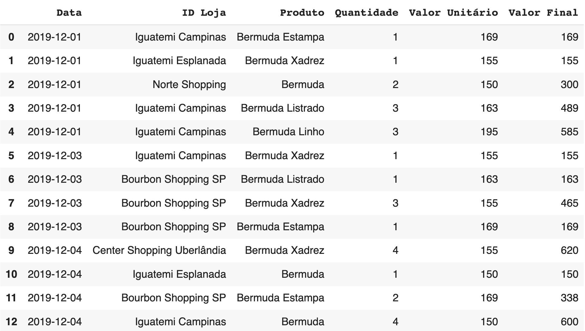
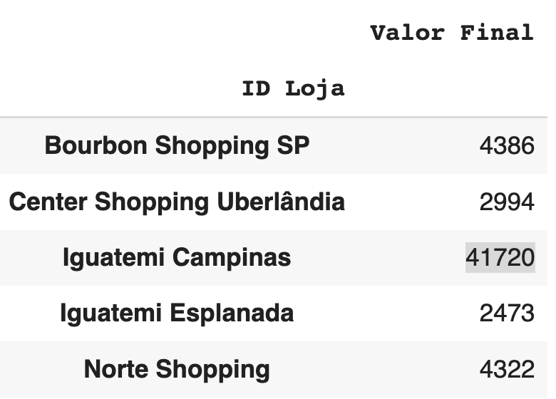
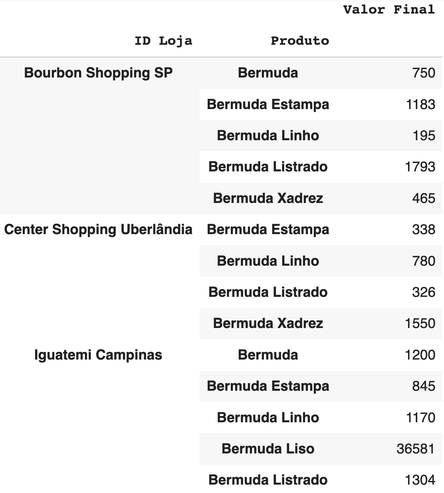

# Análises Concluídas

- Análises feitas da planilha de Vendas, em formato excel.



- Tabela inicial com as colunas de Data, Nome da loja, Produto e valor.

- Informações retiradas com a biblioteca `PANDAS` do Python.

```python
import pandas as pd

tabela = pd.read_csv("Vendas.csv")
```

# Análise por faturamento total por loja



Vemos explícitamente que na loja de Iguatemi há uma disparidade de faturamento muito grande.

# Faturamento total de produto por loja



Vemos que a bermuda Liso tem uma diferença muito grande de faturamento em relação aos outros produtos.